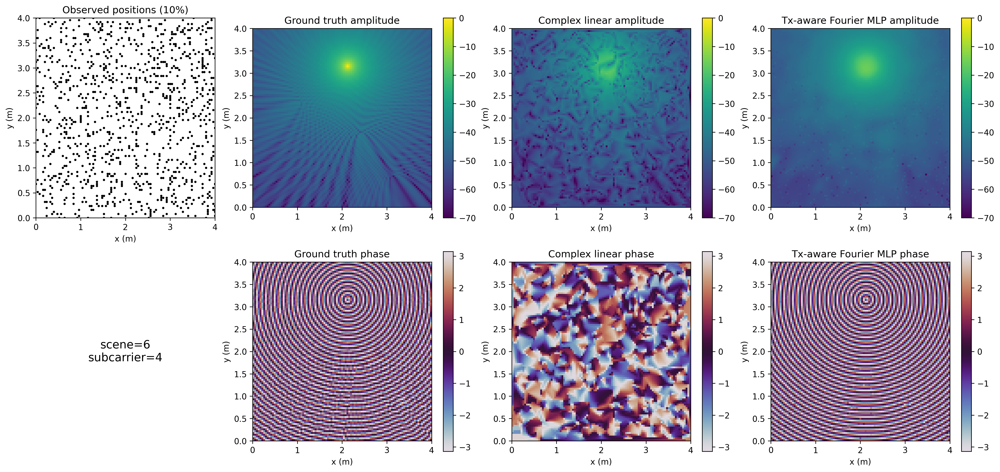
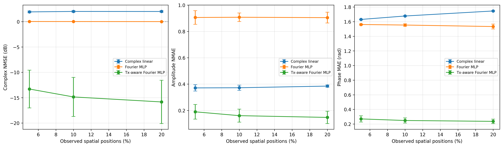

# Sparse CSI Extrapolation

基于稀疏空间测量恢复多子载波复数 CSI 的可复现实验项目。项目包含合成数据生成、复数线性插值、普通 Fourier-feature MLP，以及加入发射机位置先验的 Tx-aware Fourier MLP。

## 主要结论

- 普通复数线性插值无法稳定恢复亚波长尺度快速变化的 CSI 相位。
- 不带物理先验的 Fourier MLP 容易退化为接近零的预测，单看 NMSE 会掩盖该问题。
- 先补偿已知的直达径载波相位，再拟合较平滑的剩余复数场，可显著改善幅度和相位重建。

| 观测比例 | 方法 | 复数 NMSE (dB) | 幅度 NMAE | 相位 MAE (rad) |
|---:|---|---:|---:|---:|
| 5% | Complex linear | 1.92 | 0.371 | 1.630 |
| 5% | Tx-aware Fourier MLP | **-13.29** | **0.190** | **0.270** |
| 10% | Complex linear | 2.01 | 0.372 | 1.677 |
| 10% | Tx-aware Fourier MLP | **-14.85** | **0.161** | **0.248** |
| 20% | Complex linear | 2.00 | 0.385 | 1.746 |
| 20% | Tx-aware Fourier MLP | **-15.84** | **0.147** | **0.236** |



## 项目结构

```text
.
├── src/sparse_csi/          # 可复用的数据、插值、指标、模型和物理变换
├── experiments/             # 四个可直接运行的实验入口
│   ├── generate_dataset.py
│   ├── run_baseline.py
│   ├── run_fourier_mlp.py
│   └── run_tx_aware_mlp.py
├── data/                    # 数据说明、生成数据和数据可视化
├── results/                 # 配置、逐次结果、汇总表和实验图
├── report/                  # 中文 LaTeX 报告及配图
├── docs/PROJECT_PROGRESS.md # 实验过程和后续计划
└── pyproject.toml           # Python 项目与依赖配置
```

## 环境安装

推荐使用 Python 3.10 或更新版本。PyTorch 的 CUDA 版本应根据本机驱动选择；仅使用 CPU 也可以运行全部代码。

```bash
python -m venv .venv
```

Windows PowerShell：

```powershell
.\.venv\Scripts\Activate.ps1
python -m pip install --upgrade pip
python -m pip install -e .
```

Linux/macOS：

```bash
source .venv/bin/activate
python -m pip install --upgrade pip
python -m pip install -e .
```

本次实验使用的主要版本为 Python 3.10、NumPy 1.23.5、SciPy 1.10.1、Matplotlib 3.7.5 和 PyTorch 2.7.1。

## 快速开始

### 1. 生成并验证数据集

```bash
python experiments/generate_dataset.py
```

生成的数据位于 `data/processed/initial_csi_dataset.npz`。固定随机种子为 `2026`，数据结构详见 [`data/README.md`](data/README.md)。

### 2. 运行插值基线

先运行快速自检：

```bash
python experiments/run_baseline.py --self-test
```

再运行正式测试实验：

```bash
python experiments/run_baseline.py --run-experiment
```

### 3. 运行普通 Fourier MLP

```bash
python experiments/run_fourier_mlp.py --self-test --device auto
python experiments/run_fourier_mlp.py --tune-validation --device auto
python experiments/run_fourier_mlp.py --run-test --device auto
```

验证集调参结果保存在 `results/fourier_mlp/selected_config.json`。测试阶段只读取该配置，不再使用测试场景调参。

### 4. 运行 Tx-aware Fourier MLP

```bash
python experiments/run_tx_aware_mlp.py --self-test --device auto
python experiments/run_tx_aware_mlp.py --tune-validation --device auto
python experiments/run_tx_aware_mlp.py --run-test --device auto
```

如需强制使用 CPU，将 `--device auto` 改为 `--device cpu`。

## 数据集

- 10 个独立传播场景；
- 每个场景包含 1 条直达径和 3 条反射径；
- 8 个子载波，中心频率 3 GHz，总带宽 20 MHz；
- 4 m × 4 m 区域，101 × 101 空间网格；
- CSI 张量形状为 `(10, 8, 101, 101)`，类型为 `complex64`；
- 场景按 6:2:2 划分为训练、验证和测试集合。

## 方法说明

### Complex linear

对每个子载波的实部和虚部分别进行二维线性插值，再重新组合为复数 CSI。采样点凸包之外的位置使用最近邻结果补齐。

### Fourier MLP

使用多个方向和空间频率构造确定性 Fourier 特征，将二维坐标映射为所有子载波的实部和虚部。早停轮数只由当前场景已测位置中的内部验证子集确定。

### Tx-aware Fourier MLP

根据已知 Tx 位置和子载波频率，先消除直达径中的快速载波相位：

$$
H_{\mathrm{comp}}(\mathbf p,f)
=H(\mathbf p,f)\exp\left(j\frac{2\pi f d(\mathbf p)}{c}\right).
$$

Fourier MLP 拟合补偿后的较平滑复数场，预测完成后再恢复原始相位。

## 评价指标

- **Complex NMSE**：衡量完整复数 CSI 的归一化均方误差；
- **Amplitude NMAE**：衡量幅度预测误差；
- **Phase MAE**：使用圆周相位差衡量相位误差。

所有指标只在“未观测且有效”的空间位置上统计，并同时覆盖全部子载波。

## 结果与报告

- 汇总结果：`results/*/*summary.csv`
- 运行参数：`results/*/*metadata.json`
- 选定配置：`results/*/selected_config.json`
- 完整中文报告：`report/main.tex`
- 实验过程记录：[`docs/PROJECT_PROGRESS.md`](docs/PROJECT_PROGRESS.md)



## 可复现性

- 默认随机种子统一为 `2026`；
- 采样掩码种子由场景、采样率和重复编号确定；
- 验证场景与测试场景严格分离；
- 已观测位置在所有重建结果中原样保留；
- 每个入口均提供不依赖正式结果的 `--self-test`。
